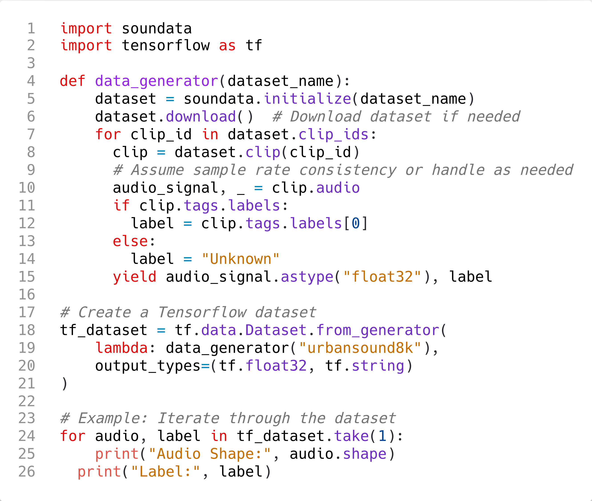

# Summary

`Soundata` is an open-source Python library for working with audio datasets in a programmatic and standardized way. It removes the need for writing custom loaders and improves reproducibility by providing tools to validate data against a canonical version. It speeds up research pipelines by allowing users to quickly download a dataset, validate that the dataset is complete and correct, and load it into memory in a standardized and reproducible way. It is designed to work with bioacoustics, environmental, urban, and spatial sound datasets; to be easy to use, easy to contribute to, and to increase reproducibility and standardize the usage of sound datasets in a flexible way.

# Statement of need

As research pipelines become increasingly complex, it is key that their different components are reproducible. In recent years, the research community has made considerable efforts towards standardization and reproducibility, with modeling and evaluation libraries ([@tensorflow, @pedregosa2011scikit, @mesaros2016metrics](#)), open sourcing models ([@zinemanas2020dcase, @speechbrain](#)) and data dissemination using resources such as [Zenodo](https://zenodo.org). However, discrepancies in the local version of the data and different practices in loading and parsing datasets can lead to considerable differences in performance results, which is misleading when comparing methods ([@bittner2019mirdata](#)). Besides, it is extremely inefficient to develop pipelines from scratch for loading and parsing a dataset for each researcher or team each time, and this increases the chances of bugs and differences that hinder reproducibility.

There are other libraries that handle datasets like `Tensorflow` ([@tensorflow](#)) or Tensorflow-Datasets([@tensorflow_datasets](#)), `DCASE-models` ([@zinemanas2020dcase](#)) or HuggingFace Datasets ([@lhoest2021datasets](#)). But none of them serve as a stand-alone library that can easily be plugged into different work pipelines, with different modeling software.  Having a community-centric, open-source, audio-specialized library allows us greater flexibility to incorporate more audio-specific API functionalities and align our priorities with those of the audio community.

`Soundata` was created following these design principles:

- **Easy to use**: Simplifies audio research pipelines considerably by having plug-and-play datasets in a standardized format. 

- **Easy to contribute to:** Users do not need to go through all the source code to contribute. `Soundata` provides extensive documentation explaining how to contribute a new loader.

- **Increase reproducibility:** Provides a common framework for researchers to compare and validate their data. It also allows to easily propagate datasets' updates or fixes to the audio community, ensuring that methods are still comparable and researchers have the same up-to-date datasets' versions.

- **Standardize usage of sound datasets:** Standardizes common attributes of sound datasets such as audio or tags to simplify audio research pipelines, while preserving each dataset's idiosyncrasies (e.g. if a dataset has ‘non-standard’ attributes, we include them as well).

`Soundata` is based on and inspired by `mirdata` ([@bittner2019mirdata](#)) with which shares goals and vision. In Music Information Research (MIR), the mentioned issues are exacerbated due to the intrinsic commercial nature of music data, since it is very difficult to get licenses to distribute music recordings openly. Since musical datasets are extremely complex compared to other audio datasets, using the same software package for handling music and other audio datasets would lead to a very complex, hard-to-manage repository, which would be difficult to scale. Instead, we introduce `Soundata` as a separate effort that specifically addresses the annotation types and formats required by communities like DCASE[^dcase], which work with bioacoustics, environmental, urban, and spatial sound datasets.

# Design Choices

`Soundata` has three main components, depicted in \autoref{fig:soundata_overview}, a `core` module that implements the generic functions used by all the data loaders (e.g. Dataset), a `utils` module with the main utility functions such as downloading and validating the data or converting to `JAMS`[^jams] format, and the dataset `loaders` containing dataset-specific code to load and parse each dataset in a standardized way. Following this design, when a new dataset requires a new functionality, it is added to the core module so it can be used for similar loaders added later on.

{ width=100% }

# Annotation Types

Annotation types in `Soundata` (see \autoref{fig:annotations}) ensure compatibility with existing evaluation libraries from the DCASE community such as `sed_eval`, and are convertible to the `JAMS` format. These annotation types allow `Soundata` to support a wide range of audio research tasks, as shown in \autoref{fig:tasks}. It currently includes three annotation types :

- **Tags**: String labels with associated confidence values, spanning the full duration of the audio clip.
- **Events**: These annotations are for sound events with defined start times, end times, labels, and (optionally) confidence values. 
- **Spatial Events**: Spatial Events extends Events introducing additional attributes such as geographical coordinates (latitude, longitude), altitude, direction (azimuth and elevation), and distance from reference points.

{ width=100% }

{ width=100% }

## Example usage \label{sec:example_usage}

`Soundata` is designed to be user-friendly, so that users can start working with audio datasets right away after following a few steps, as summarized in \autoref{fig:supported_datasets}. 

{ width=100% }

Once the dataset is downloaded and validated, `Soundata` can be integrated into an audio research pipeline easily. The code in \autoref{fig:example} shows an example of how to get any SED dataset into a deep learning pipeline using `Soundata` and `Tensorflow`. 

{ width=100% }

## Contributing \label{sec:contributing}

Contribution to `Soundata` is highly encouraged. To facilitate the process, `Soundata` provides an exhaustive contributing guide[^contributing] available in the documentation with all the necessary information on how to contribute. The most common contribution in `Soundata` is the creation of new dataset loaders, as they play a crucial role in advancing `Soundata`'s objective of accommodating as many datasets as possible. \autoref{fig:contributing} summarizes the process of creating a new loader.

{ width=100% }

# Acknowledgements

We extend our sincere gratitude to all the contributors who have been invaluable in the development of this library. We deeply appreciate contributions and look forward to continued collaboration and growth.

# References

[^python]: [https://www.python.org/](https://www.python.org/)
[^dcase]: [https://dcase.community/](https://dcase.community/)
[^jams]: [https://github.com/marl/jams](https://github.com/marl/jams)
[^supported_datasets]: [https://soundata.readthedocs.io/en/latest/source/quick_reference.html](https://soundata.readthedocs.io/en/latest/source/quick_reference.html)
[^contributing]: [https://soundata.readthedocs.io/en/latest/source/contributing.html](https://soundata.readthedocs.io/en/latest/source/contributing.html)
[^pr]: [https://github.com/soundata/soundata/pulls](https://github.com/soundata/soundata/pulls)